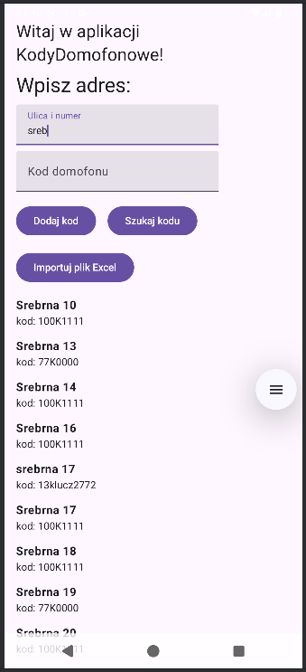
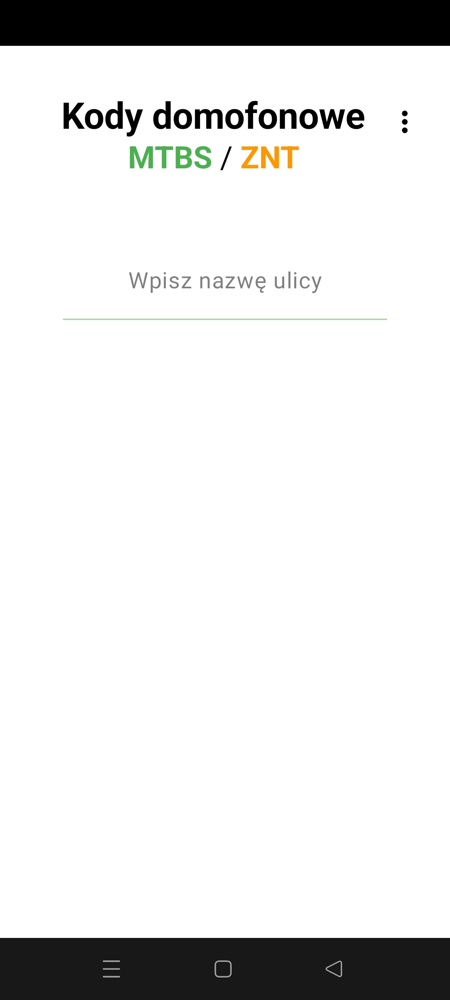
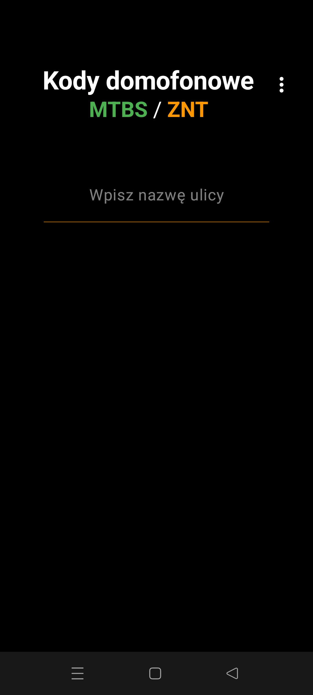

# 📱 KodyDomofonoweApp

**Aplikacja mobilna Android do przeglądania kodów domofonowych na podstawie nazwy ulicy.**

---

## ✨ Funkcje aplikacji

- 🔍 Wyszukiwanie kodów niezależnie od wielkości liter i polskich znaków
- ➕ Dodawanie nowych adresów i kodów bez modyfikacji kodu aplikacji
- 📂 Import danych z pliku Excel (`.xlsx`)
- 💾 Przechowywanie danych w bazie lokalnej lub pliku (Excel jako główna baza)
- ✅ Prosty, czytelny interfejs

---

## 🧪 Status projektu

✅ Projekt w trakcie rozwoju — aktualna wersja działa i pozwala wyszukiwać oraz dodawać dane.  
🛠️ Trwają prace nad dalszym rozbudowaniem funkcji.

---

## 🛠️ Technologie

- Kotlin + Jetpack Compose
- Room (baza danych)
- Apache POI (do odczytu Excela)
- Android Studio

## 🧭 Plany rozwoju

- 📌 Dodanie edycji istniejących kodów
- 📤 Eksport danych z aplikacji do Excela
- 🌐 Synchronizacja z chmurą (np. Google Drive)
- 🔒 Zabezpieczenie kodów hasłem lub PIN-em

---

## 👤 Autor

Inż. Damian  **Zgred**  
YouTube: https://www.youtube.com/@StaryZgred2022
Repozytorium: [github.com/damiano88s/KodyDomofonoweApp](https://github.com/damiano88s/KodyDomofonoweApp)

---

## 🖼️ Zrzut ekranu

